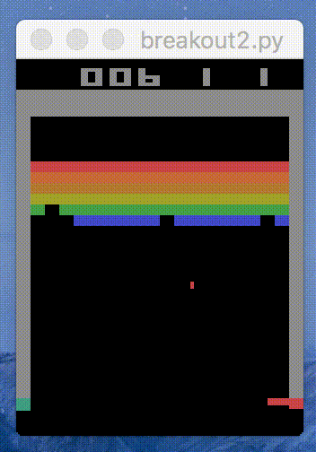

## Implementations of Reinforcement Learning Algorithms in Python

(Working in progress) Implementations of selected reinforcement learning algorithms with tensorflow and openai gym. Trying to make each algorithm standalone and easy to run. 

-Yiren Lu (luyiren [at] seas [dot] upenn [dot] edu)

### Implemented Algorithms

##### Dynamic Programming MDP Solver

- `DP/value_iteration.py`: value iteration
- `DP/policy_iteration.py`: policy iteration - policy evaluation & policy improvement

##### Temporal Difference Learning

- `TD/qlearning.py`: standard epsilon greedy qlearning
- `DQN/dqn.py`: Deep Q-network agent - vanilla network

##### Monte Carlo Methods

- `monte_carlo/monte_carlo.py`: epsilon greedy monte carlo agent that learns episodes of experiences

##### Policy Gradient Methods (WIP)

- `policy_gradient/policy_gradient_nn.py`: REINFORCE with policy function approximation

### OpenAI Gym Examples

- Cartpole-v0
  - `td/cartpole_qlearning.py`: [solved cartpole-v0 after 1598 episodes of training](https://gym.openai.com/evaluations/eval_qXAq3TZxS6WBnMci1xJ4XQ#reproducibility)
  - `dqn/cartpole_dqn.py`: [solved cartpole-v0 after 75 episodes of training](https://gym.openai.com/evaluations/eval_ry9ynv6ZQQm14FJdT7dvQ)
  - `policy_gradient/cartpole_policy_gradient.py`: REINFORCE [solved cartpole-v0 after 632 episodes](https://gym.openai.com/evaluations/eval_0qE4YdUoQMi60hslLEGg)

- Breakout-v0 (refactoring.., code to be updated)

### Environments

- `envs/gridworld.py`: minimium gridworld implementation for testings

### Dependencies

- Numpy
- OpenAI Gym (with Atari)
- Tensorflow
- matplotlib (optional)

### Tests

- Files: `test_*.py`
- Run unit test for [class]:

`python test_[class].py`

- Test coverage (requires `coverage` and `nose`):

`nosetests --with-coverage --cover-package=.`

### MIT License

