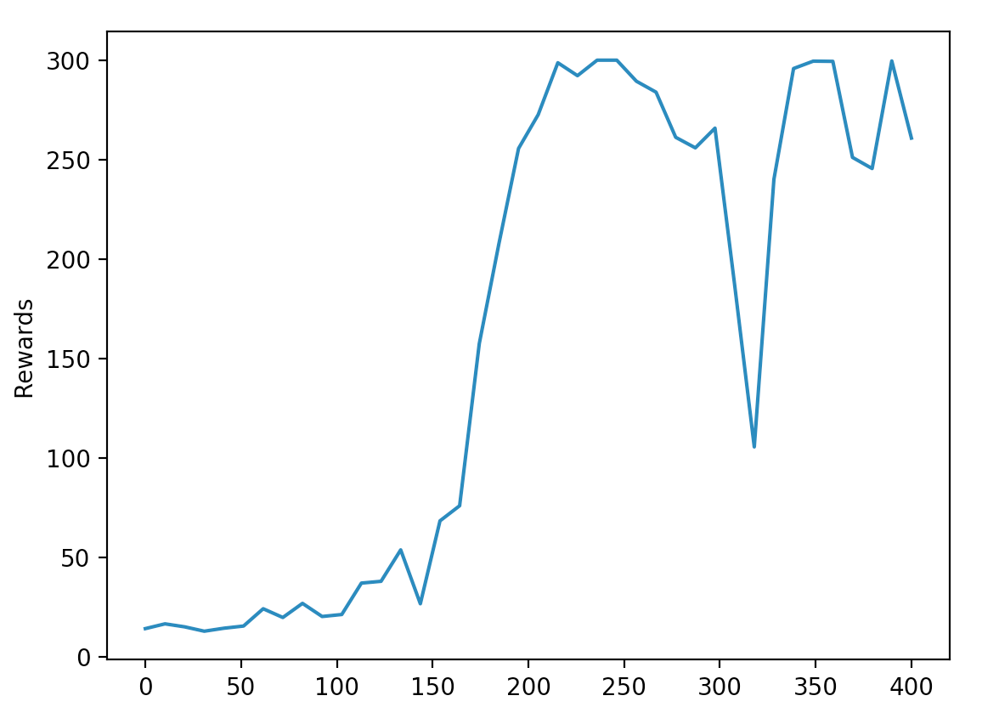
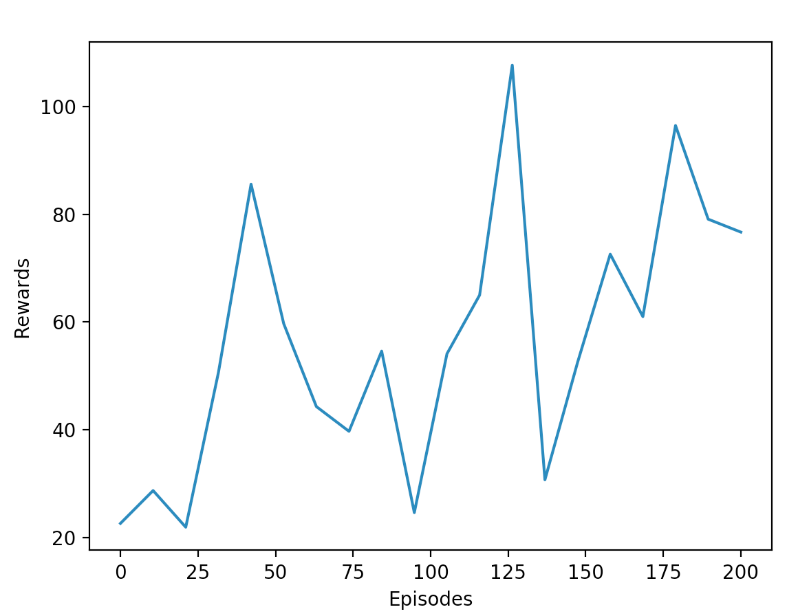

## Policy Gradient Methods

(Working in progress)

### REINFORCE 

The policy function is approximated by a 4-layer fully connected network with l2 regularization. The algorithm [solved cartpole-v0 after 632 episodes](https://gym.openai.com/evaluations/eval_0qE4YdUoQMi60hslLEGg)

- `policy_gradient_nn.py`: REINFORCE with policy function approximation
- `cartpole_reinforce.py`: working example on cartpole-v0

#### Run Code

`$ python cartpole_reinforce.py`

#### Cartpole-v0 Result

### REINFORCE with Baseline

Here the code shows REINFORCE algorithm with baseline. The policy and value function share the same network regularized by l2. Have not been tuning the hyperparameters too much. Sometimes the model quickly converges to a local optimal (degenerate policy) due to random initialization, but a few attempts (<5) should be sufficient.

- `reinforce_w_baseline.py`: REINFORCE with baseline
- `cartpole_reinforce_baseline.py`: working example on cartpole-v0

#### Run Code

`$ python cartpole_reinforce_baseline.py`

#### Cartpole-v0 Result

